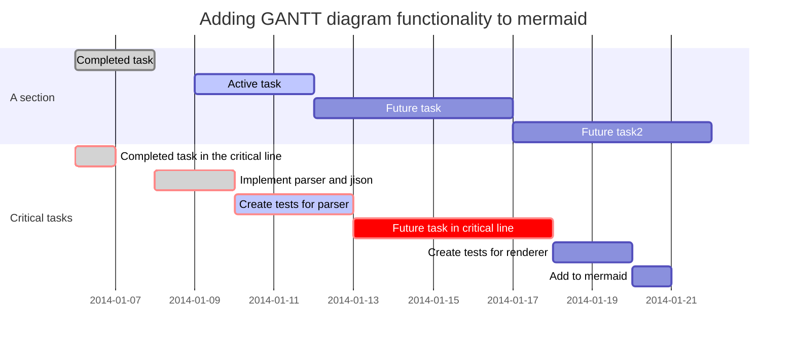
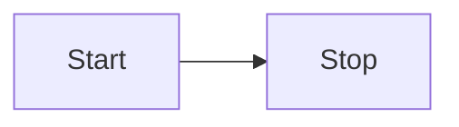
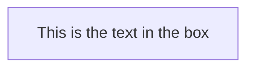
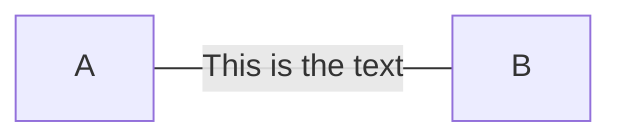
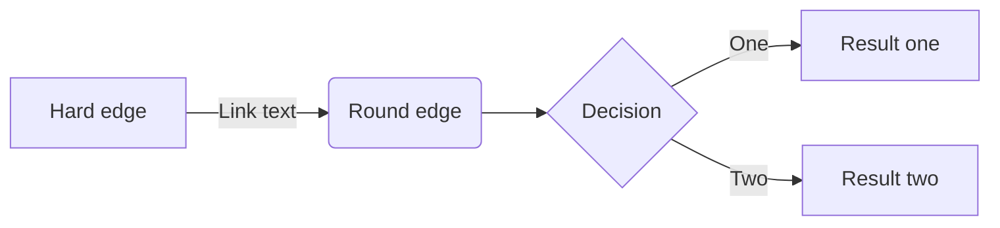
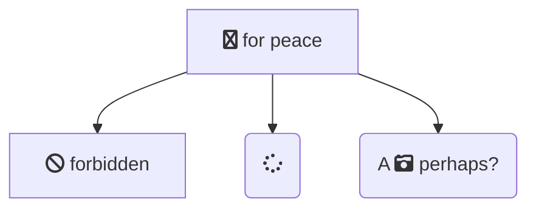
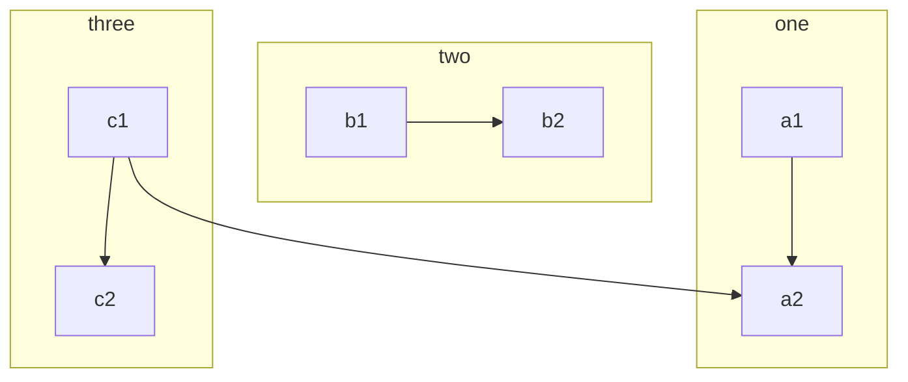
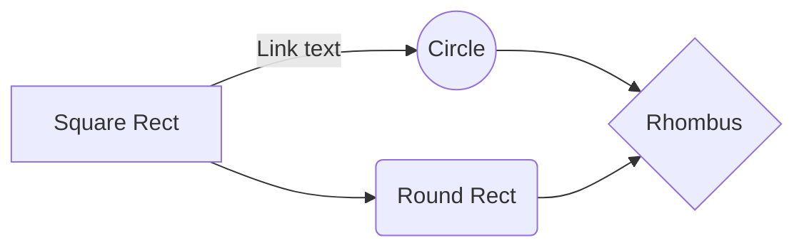
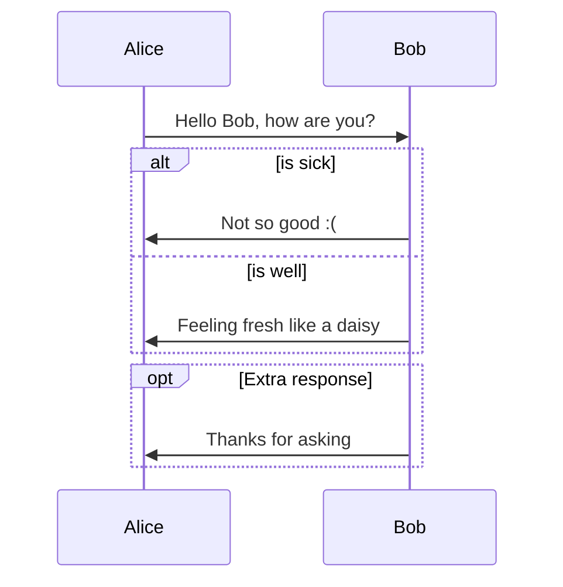

import { withDoc } from '@app/lib/with-doc'
import { Expand } from '@app/components'
export const meta = {
  title: 'Отладка markdown'
}

# This is an h1

## This is an h2

### This is an h3

#### This is an h4

##### This is an h5

###### This is an h6


Ebaloger: новый сервис в составе. Отбирает у докера логи контейнеров, принимает другую часть через сокет, стримит все это добро на вронтенд в app. 
Ebaloger: новый сервис в составе. Отбирает у докера логи контейнеров, принимает другую часть через сокет, стримит все это добро на вронтенд в app.
Ebaloger: новый сервис в составе. Отбирает у докера логи контейнеров, принимает другую часть через сокет, стримит все это добро на вронтенд в app.

Ebaloger: новый сервис в составе. Отбирает у докера логи контейнеров, принимает другую часть через сокет, стримит все это добро на вронтенд в app.
Ebaloger: новый сервис в составе. Отбирает у докера логи контейнеров, принимает другую часть через сокет, стримит все это добро на вронтенд в app.


[[tip]]
| block content with tip

Адрес страницы, предшествующий той, на которой произошло событие. Адрес страницы, предшествующий той, на которой произошло событие. 
Адрес страницы, предшествующий той, на которой произошло событие. 
Адрес страницы, предшествующий той, на которой произошло событие. 
Адрес страницы, предшествующий той, на которой произошло событие. 

[[success]]
| block content with success color


[[info]]
| block content with info color


[[info | With header! ]]
| block content with info color

[[alert]]
| block content like alert block content like alert block 
| content like alert block content like alert block content like 
| alert block content like alert block content like alert block content 
| like alert block content like alert block content like alert block content like alert block content like alert


[[alert | And head!]]
| block content like alert block content like alert block 
| content like alert block content like alert block content like 
| alert block content like alert block content like alert block content 
| like alert block content like alert block content like alert block content like alert block content like alert


## Mermaid





















sequence








## Short py code

```python
import sys
from . import settings, start_server

def main():
    start_server(**settings)

if __name__ == '__main__':
    main()
```

## full w

<Expand>

```python
import sys
from . import settings, start_server

def main():
    start_server(**settings)

if __name__ == '__main__' and full_W:
    main()
```

</Expand>


### JS Code

inline

This is `inline code` element

block

```html
<script type="text/javascript">
  !function (w, d, st, rst, se, he) {
    if(w.rstat) return; rst = w.rstat = function () {
      var args = Array.prototype.slice.call(arguments);
      return rst.doCall ? rst.doCall.call(rst, args) : rst._q.push(args); };
    rst.push = rst; rst._l = !0; rst._sv = 3.0; rst._q = [];
    rst._jsl = function (src) {
      se = d.createElement(st); se.async = !0; se.src = src;
      he = d.getElementsByTagName(st)[0]; he.parentNode.insertBefore(se, he); };
    rst.attach = function(host){ rst._host = host; rst._jsl('https://'+rst._host+'/lib.js'); }
  }(window, document, 'script');
  // Configuration
  rstat('configure', {
    projectId: 1 // <<< придумайте номер сайта, если их несколько
  });
  rstat('page'); // <<< отправка просмотра страницы, убирается на SPA
  rstat.attach('tracker.rockstat.test') // <<< Подставьте домен, на котором расположен трекер
</script>
```

loooooong code


```
curl -s https://raw.githubusercontent.com/rockstat/bootstrap/master/bin/kickstart | sudo -E bash - && echo "ready!"

```

## Lists (H2)

### 14 sep 2018 (H3)

- **infr** В Grafana изначально добавлен ClickHouse datasource, а также уже встроен демо-дашбород.
- **dash** Реструктуризация кода Dashboards для дальнейшей разработки интерфейсов управления контейнерами
- **band** Новый API band framework: `@dome` больше нет, теперь функции помечаются так:
    - `@expose()` - делает метод доступным другим сервисам, но не регистрируется в Front
    - `@expose.handler()` - регистрация обработчиком в Front
    - `@expose.enricher(keys=['in.gen.track'], props=dict(ip='td.ip'))` - регистрация обогатителя в Front - пример обогатителя из сервиса mmgeo
    - `@export.listener()` - регистрация слушателя в Front
    - `@worker()` - регистрация воркером сервиса
    - `@cleaner()` - регистрация чистильщиком сервиса, будет запущен при остановке.
- Ebaloger: новый сервис в составе. Отбирает у докера логи контейнеров, принимает другую часть через сокет, стримит все это добро на вронтенд в app.
- **dash** Конечно же фронтовое приложение, предназначенное под получение и отображение логов, заточено под большое количество данных
- **infr** На 90% завершен переход на предварительно собранные образы сервисов. Собираются в открытом виде в travis-ci
- **bootstrap** Новый способ получения SSL. Разработана новая роль для Ansible, она использует альтенативный клиент acme.sh, и умеет получать
  wildcard сертификаты (*.вашдомен), причем делать это не вмешиваясь в работу сервера, используя DNS-challenge.


## Simple table

| Property          |Type       |Default    |Description
|---------------------|---------|---------|--------------------------------------------------------------------------------------------------------------------------|
| projectId           | Number  | 1       | Произвольный ID сайта/проекта/чего-то еще                                                                                |
| sessionTimeout      | Number  | 1800    | Тайм-аут сессии: сколько времени с   последнего события должно пройти                                                    |
| lastCampaignExpires | Number  | 7776000 | Период, на который запоминаются   последние рекламные метки. Указывается в секундах.                                      |
| cookieDomain        | String  | auto    | Домен                                                                                                                    |
| trackActivity       | Boolean | true    | Флаг автоматического отслеживания   активности посетителей на сайте. Отслеживается движение мышью                        |
| trackClicks         | Boolean | true    | Автоматическое отслеживание   кликов. Обрабатывает все клики и автоматически классифицирует их на   внутренние и внешние |
| trackForms          | Boolean | true    | Автоматическое отслеживание   взаимодействий с формами. Генерирует события фокуса                                        |
| allowHTTP           | Boolean | false   | По умолчанию работает только на   https. Этим параметром можете разрешить работу на http                                   |

## Схема ClickHouse


### events_v2

<Expand>

| Колонка                    | Тип CH         | Тип JS  | Описание                                                                                                                                                    |
|----------------------------|----------------|---------|-------------------------------------------------------------------------------------------------------------------------------------------------------------|
| id                         | UInt64         | -       | Идентификатор записи                                                                                                                                        |
| date                       | Date           | -       | Дата                                                                                                                                                        |
| dateTime                   | DateTime       | -       | Дата и время                                                                                                                                                |
| timestamp                  | UInt64         | -       | timestamp в миллисекундах                                                                                                                                   |
| projectId                  | UInt32         | number  | Идентификатор сайта или проекта, назначаемый в snippet'e или полученный по API                                                                              |
| name                       | String         | string  | Название события                                                                                                                                            |
| uid                        | UInt64         | string  | Идентификатор посетителя, кроссдоменный                                                                                                                     |
| ip                         | String         | string  | IP-адрес посетителя                                                                                                                                         |
| userAgent                  | String         | string  | Заголовок User-Agent браузера                                                                                                                               |
| page:url                   | String         | string  | Адрес страницы, на которой произошло событие |
| page:referrer              | String         | string  | Адрес страницы, предшествующий той, на которой произошло событие                                                                                            |
| page:title                 | String         | string  | Заголовок страницы, отображаемый на вкладке браузера                                                                                                        |
| page:domain                | String         | string  | Домен                                                                                                                                                       |
| page:proto                 | Enum8          | enum    | Протокол сайта ('' = 0, 'http' = 1, 'https' = 2, 'other' = 3)                                                                                               |
| page:query:utm_source      | String         | string  | Метка рекламного канала                                                                                                                                     |
| page:query:utm_campaign    | String         | string  | Метка рекламной кампании                                                                                                                                    |
| page:query:utm_medium      | String         | string  | Метка типа рекламного канала                                                                                                                                |
| page:query:utm_content     | String         | string  | Метка рекламного объявления                                                                                                                                 |
| page:query:utm_term        | String         | string  | Метка критерия показа рекламного объявления                                                                                                                 |
| page:query:gclid           | String         | string  | Идентификатор клика по объявлению от Google AdWords                                                                                                         |
| page:query:yclid           | String         | string  | Идентификатор клика по объявлению от Яндекс Директ                                                                                                          |
| page:query                 |                | Object  | Объект с параметрами                                                                                                                                        |
| page:query.key             | Array(String)  |         | Названия параметров, для которых нет своих полей                                                                                                            |
| page:query.value           | Array(String)  |         | Значения параметров, для которых нет своих полей                                                                                                            |
| session:type               | String         | string  | Тип сессии, определенный трекером , например: organic или social                                                                                            |
| session:engine             | String         | string  | Идентификатор крупного игрока рынка,  с которого пришел посетитель, например: google или facebook                                                           |
| session:num                | UInt16         | number  | Порядковый номер визита этого пользователя на этом сайте                                                                                                    |
| session:hasMarks           | UInt8          | number  | Параметр, показывающий наличие/отсутствие рекламных меток                                                                                                   |
| session:pageNum            | UInt16         | number  | Порядковый номер просмотра страницы за эту сессию                                                                                                           |
| session:eventNum           | UInt16         | number  | Порядковый номер события за эту сессию                                                                                                                      |
| session:marks:utm_source   | String         | string  | Рекламная система,  с которой пришел посетитель (например, Яндекс Директ)                                                                                   |
| session:marks:utm_campaign | String         | string  | Метка рекламной кампании                                                                                                                                    |
| session:marks:utm_medium   | String         | string  | Тип трафика, например: cpc или cpm                                                                                                                          |
| session:marks:utm_content  | String         | string  | Тип рекламного объявления, например: text или banner                                                                                                        |
| session:marks:utm_term     | String         | string  | Ключевое слово, которое инициировало показ объявления                                                                                                       |
| session:marks:has_gclid    | Int8 { 0 / 1 } | boolean | Признак наличия параметра gclid / Google AdWords                                                                                                            |
| session:marks:has_yclid    | Int8 { 0 / 1 } | number  | Признак наличия параметра yclid / Яндекс Директ                                                                                                             |
| session:marks              |                | Object  | Объект со всеми метками                                                                                                                                     |
| session:marks.key          | Array(String)  |         | Названия параметров рекламных меток, под которые нет своих полей                                                                                            |
| session:marks.value        | Array(String)  |         | Значения параметров рекламных меток, под которые нет своих полей                                                                                            |
| session:start              | UInt64         | number  | timestamp начала сессии в формате в миллисекундах                                                                                                           |
| session:refHost            | String         | string  | Домен из referrer                                                                                                                                           |
| lib:name                   | String         | string  | Имя клиентской библиотеки, сейчас alco.js""                                                                                                                 |
| lib:libver                 | UInt32         | number  | Версия библиотеки                                                                                                                                           |
| lib:snippet                | UInt32         | number  | Версия сниппета, установленного на сайте                                                                                                                    |
| client:tz                  | String         | string  | Название часового пояса на девайсе посетителя сайта                                                                                                         |
| client:ts                  | UInt64         | number  | timestamp из браузера посетителя                                                                                                                            |
| client:tzOffset            | Int32          | number  | смещение времени у посетителя сайта относительно UTC в миллисекундах                                                                                        |
| client:platform            | String         | string  | Платформа устройства посетителя (macIntel и тп)                                                                                                             |
| browser:if                 | Array(UInt8)   | array   | Признаки, что сайт открыт в iframe                                                                                                                          |
| browser:wh:w               | UInt16         | number  | Ширина контентного окна                                                                                                                                     |
| browser:wh:h               | UInt16         | number  | Высота контентного контентного окна                                                                                                                         |
| browser:sr:tot:w           | UInt16         | number  | Ширина от разрешения экрана                                                                                                                                 |
| browser:sr:tot:h           | UInt16         | number  | Высота от разрешения экрана                                                                                                                                 |
| browser:sr:avail:w         | UInt16         | number  | Максимальный размер, на который может быть растянуто окно браузера посетителя в ширину                                                                      |
| browser:sr:avail:h         | UInt16         | number  | Максимальный размер, на который может быть растянуто окно браузера посетителя в высоту                                                                      |
| browser:sr:asp             | UInt16         | number  | Коэффициент уплотнения экрана на на клиентском устройстве (как пример, retina)                                                                              |
| browser:sr:oAngle          | UInt16         | number  | Угол поворота экрана на устройстве посетителя                                                                                                               |
| browser:sr:oType           | String         | number  | Ориентация экрана, landscape или primary                                                                                                                    |
| sxg                        |                |         | Результаты геокодинга по ip  при помощи базы Sypex Gep                                                                                                      |
| sxg:country:iso            | String         |         | Сокращённое название страны, например: RU                                                                                                                   |
| sxg:country:name_ru        | String         |         | Название страны посетителя на русском, например: Россия                                                                                                     |
| sxg:country:name_en        | String         |         | Название страны посетителя на английском, например: Russia                                                                                                  |
| sxg:region:iso             | String         |         | Сокращенное название города и страны, определенных по IP посетителя, например: RU-MOW                                                                       |
| sxg:region:name_ru         | String         |         | Название региона посетителя на русском языке, например: Москва                                                                                              |
| sxg:region:name_en         | String         |         | Название региона посетителя на английском языке, например:  Moscow                                                                                          |
| sxg:city:id                | UInt32         |         | ID города                                                                                                                                                   |
| sxg:city:name_ru           | String         |         | Название города посетителя на русском языке, например: Москва                                                                                               |
| sxg:city:name_en           | String         |         | Название города посетителя на английском языке, например:  Moscow                                                                                           |
| mdd                        |                |         | Результат разбора User-Agent при помощи библиотеки Matomo (Piwik) device detector                                                                           |
| mdd:isBot                  | Int8           |         | Признак бота, если он представился, как это делают аналитические и поисковые боты                                                                           |
| mdd:client:type            | String         |         | Тип программы, через которую был осуществлен доступ, например: browser                                                                                      |
| mdd:client:name            | String         |         | Название бразуера посетителя, например: Chrome                                                                                                              |
| mdd:client:version         | String         |         | Версия браузера посетителя, например: 63.0                                                                                                                  |
| mdd:os:name                | String         |         | Название операционной системы, установленной на устройстве посетителя, например: mac                                                                        |
| mdd:os:version             | String         |         | Версия операционной системы, установленной на устройстве посетителя, например: 10.13                                                                        |
| mdd:os:platform            | String         |         | Рязрядность операционной системы (для десктопа), например: x64                                                                                              |
| mdd:device:type            |                |         | Тип устройства посетителя, например: desktop                                                                                                                |
| mdd:device:brand           | String         |         | Бренд устройства, если это мобилка, например:  AP или SA                                                                                                    |
| mdd:device:model           | String         |         | Модель мобилки, например : GALAXY S7                                                                                                                        |
| user                       |                | Object  | Объект со всеми данными о пользователе                                                                                                                      |
| user:id                    | String         | string  | ID юзера на самом сайте. Устанавливается через identify                                                                                                     |
| user:gaId                  | String         | string  | Google Analytics clientId                                                                                                                                   |
| user:ymId                  | String         | string  | Yandex Metrica  clientId                                                                                                                                    |
| user:traits.key            | Array(String)  |         | Ключи параметров посетителя, под которые нет своих полей                                                                                                    |
| user:traits.value          | Array(String)  |         | Значения параметров посетителя,  под которые нет своих полей                                                                                                |
| data                       |                | Object  | Объект с ключами и значениями содержащими данные события                                                                                                    |
| data.key                   | Array(String)  |         | Название данных события, под которые нет своих полей                                                                                                        |
| data.value                 | Array(String)  |         | Параметры данных события, под которых нет своих полей                                                                                                       |
| scroll                     |                | Object  | Объект с данные о положении на странице                                                                                                                     |
| scroll:docHeight           | UInt16         | number  | Полная высота html документа                                                                                                                                |
| scroll:clientHeight        | UInt16         | number  | Высота того что видит юзер ---- window innerWidth                                                                                                           |
| scroll:topOffset           | UInt16         | number  | Отступ позиции скролла в пикселях                                                                                                                           |
| scroll:scroll              | UInt16         | number  | Проложение на странице в момент появления события                                                                                                           |
| scroll:maxScroll           | UInt16         | number  | Максимальный скролл на текущей странице в %                                                                                                                 |
| cf:locstor                 | Int16          | boolean | Поддержка браузером localStorage                                                                                                                            |
| cf:addel                   | Int16          | boolean | Поддержка браузером addEventListener                                                                                                                        |
| cf:promise                 | Int16          | boolean | Поддержка браузером Promise                                                                                                                                 |
| cf:sbeacon                 | Int16          | boolean | Поддержка браузером sendBeacon                                                                                                                              |
| cf:wpush                   | Int16          | boolean | Поддержка браузером WebPush API                                                                                                                             |
| perf                       |                | Object  | Метрики производительности                                                                                                                                  |
| perf:cs                    | Int16          | number  | Connection Start:  браузером отправлен запрос серверу на установку подключения . Точка отчета для остальных событий                                         |
| perf:ce                    | Int16          | number  | Connection End:  коннект установлен. мс с момента cs                                                                                                        |
| perf:scs                   | Int16          | number  | Secure Connection Start: начало установки защищенного соединения. Если не устанавливается, вернется -1. мс с момента cs                                     |
| perf:rqs                   | Int16          | number  | Request Start: браузер отравил на сервер htts запрос. мс с момента cs                                                                                       |
| perf:rss                   | Int16          | number  | Response Start: пришел перый байт html документа с сервера. мс с момента cs                                                                                 |
| perf:rse                   | Int16          | number  | Response End: передача данных с сервера завершена. мс с момента cs                                                                                          |
| perf:dl                    | Int16          | number  | Dom Loading: браузер начал строить  DOM. мс с момента cs                                                                                                    |
| perf:di                    | Int16          | number  | Dom Interactive: загружены html и js, браузер в интерактивном режиме. мс с момента cs                                                                       |
| perf:dc                    | Int16          | number  | Dom Complete: завершена загрузка стилей и изображений,  страница готова. мс с момента cs                                                                    |

</Expand>


export default withDoc({...meta})(({children}) => <>{children}</>)
